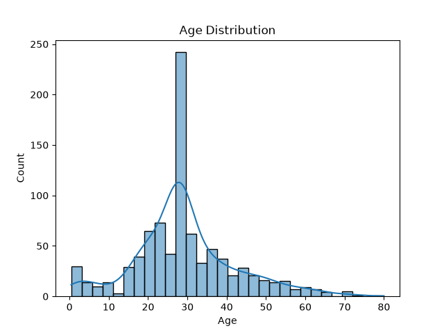
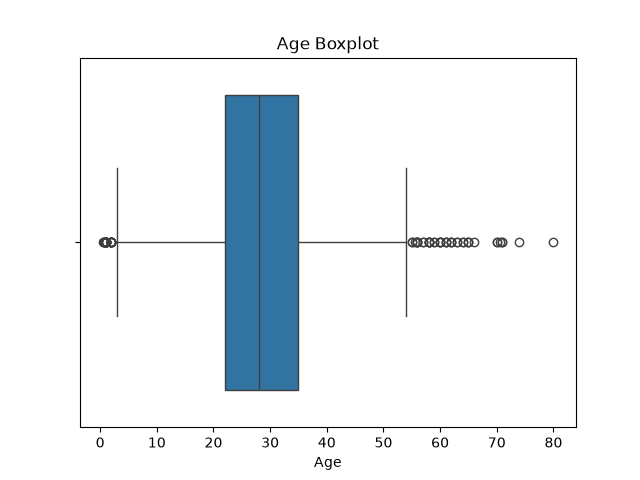
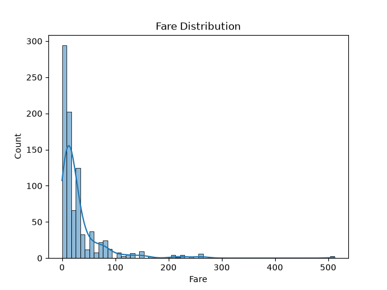
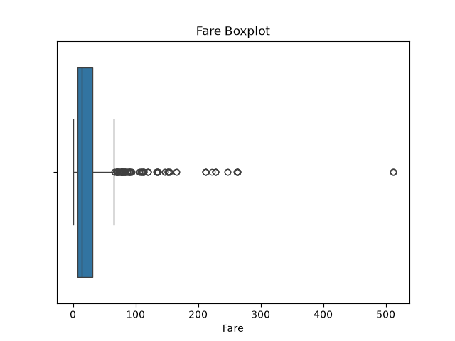
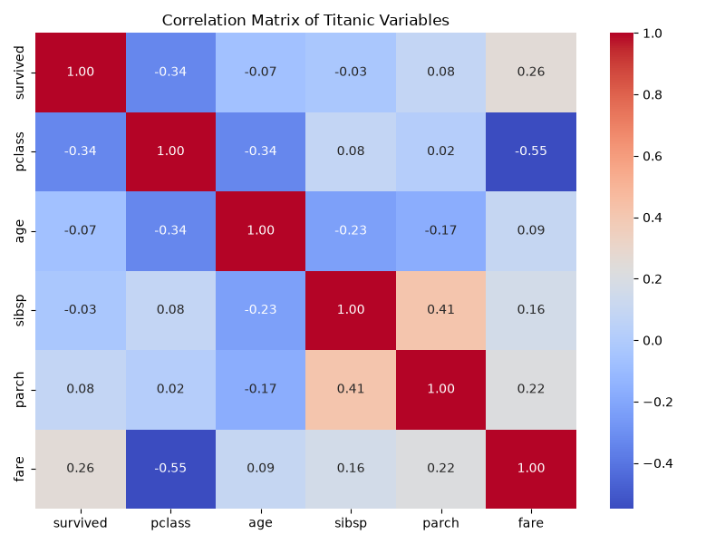
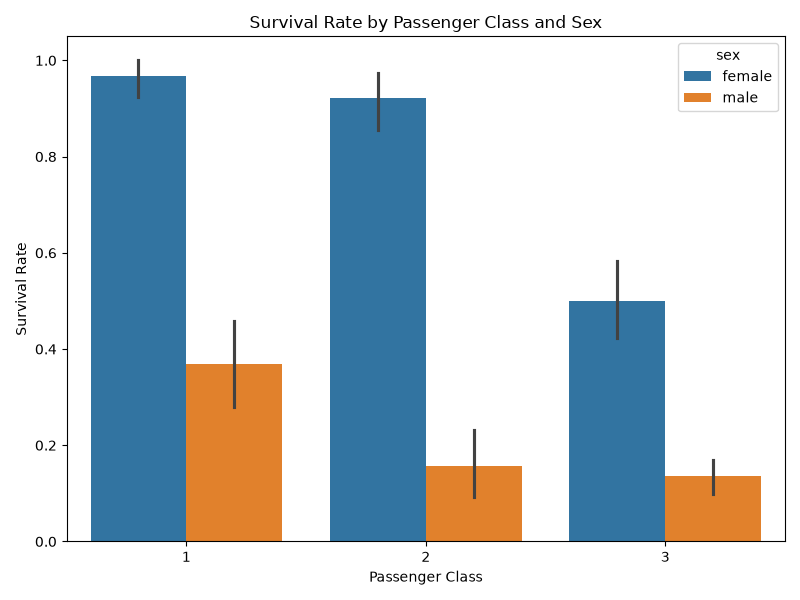
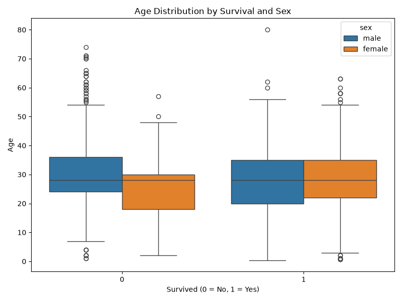
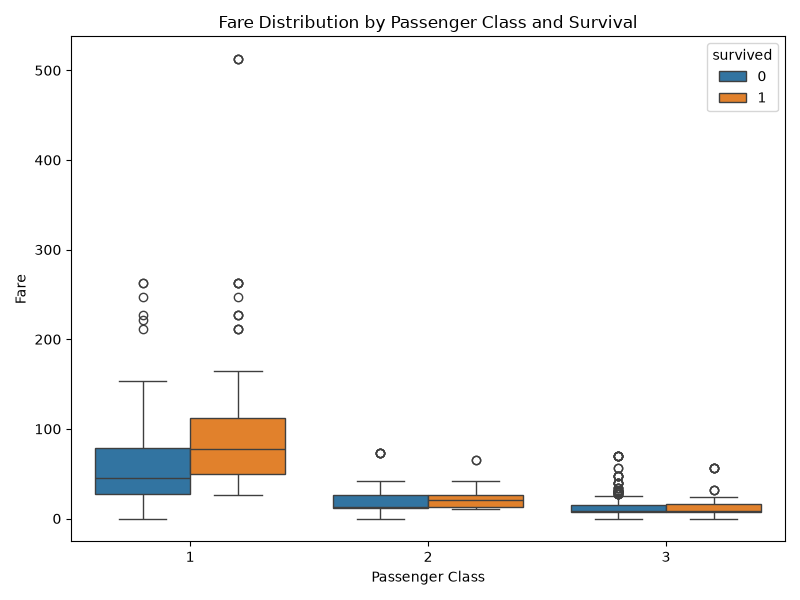
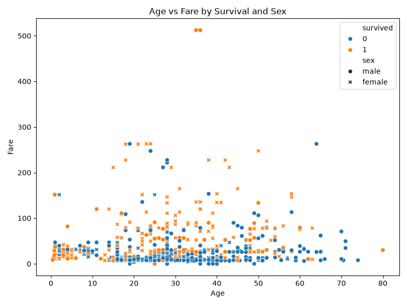
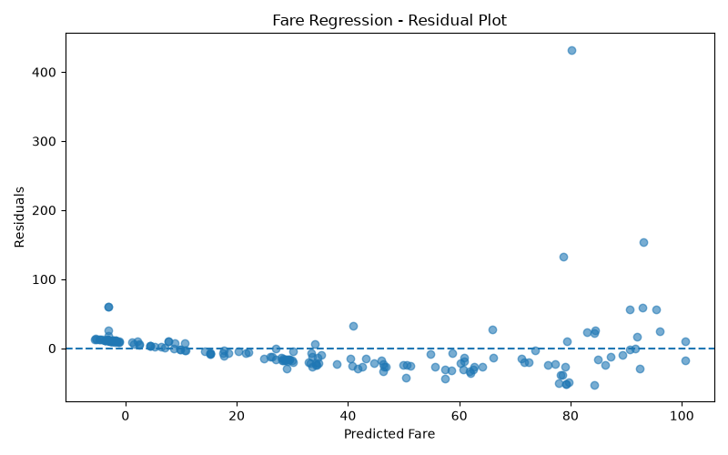

# Module 2 - Titanic Analytics Pipeline

## 1. Dataset

The Titanic dataset was loaded using Seaborn:

`sns.load_dataset("titanic")`

The dataset contains **891 rows and 15 columns**.

The dataset was loaded only once and saved as `titanic.csv` inside the analytics folder. This is kept as the original raw dataset.

After cleaning the data, the cleaned dataset was saved as `cleaned_titanic.csv`.

The cleaned dataset contains **889 rows and 14 columns** and is used for the further analysis and modeling.

## 2. Missing Values

The following missing values were found:

* **Age:** 19.87% missing. Since it is between 5% and 30%, the missing values were filled using the median age.
* **Embarked:** 0.22% missing. Since it is less than 5%, the rows with missing values were removed.
* **Embark_town:** 0.22% missing. The rows with missing values were removed because the missing percentage was less than 5%.
* **Deck:** 77.22% missing. Since a very large amount of data was missing, this column was removed.

After cleaning, the dataset has **889 rows and 14 columns** and there are no remaining missing values.

# 3. Univariate Analysis

### Age

The mean age was about **29.32 years** and the median age was **28 years**.

The IQR method identified **65 outliers** in age.

### Fare

The mean fare was about **32.10**, the median was **14.45**, and the mode was **8.05**.

Since the mean fare is greater than the median and the median is greater than the mode, the fare distribution is **right-skewed**.

The IQR method identified **114 outliers** in fare.

The fare boxplot also shows some very high fare values.

## 4. Bivariate Analysis

### Survival by Sex

The survival rate was:

* Male: **18.89%**
* Female: **74.04%**

Female passengers had a much higher survival rate than male passengers.

### Survival by Passenger Class

The survival rate was:

* Pclass 1: **62.62%**
* Pclass 2: **47.28%**
* Pclass 3: **24.24%**

Passengers in higher classes had higher survival rates in this dataset.

### Survival by Sex and Passenger Class

The survival rates for different groups were also checked using boolean masking.

The results showed differences between male and female passengers within the different passenger classes.

This shows that both sex and passenger class were related to survival.

### Correlation

The correlation matrix was created using these six columns:

`survived, pclass, age, sibsp, parch, fare`

The two strongest correlations were:

* **Pclass and Fare: -0.548**
* **Sibsp and Parch: 0.415**

The negative correlation between Pclass and Fare means that higher Pclass numbers were generally associated with lower fares.

The positive correlation between Sibsp and Parch means that passengers with more siblings/spouses also tended to have more parents/children travelling with them.

## 5. Multivariate Analysis

Four different charts were created to understand the relationship between multiple variables.

### Chart 1: Survival by Sex and Passenger Class

Female passengers had higher survival rates than male passengers.

Passengers in higher classes also generally had higher survival rates.

This shows that sex and passenger class were both related to survival.

### Chart 2: Age Distribution by Survival and Sex

The age distributions of survivors and non-survivors overlap in many groups.

There are still some differences between the groups.

This shows that age alone cannot completely explain survival.

### Chart 3: Fare by Passenger Class and Survival

First-class passengers generally paid higher fares than second- and third-class passengers.

Survivors also generally had higher fares than non-survivors.

This shows a relationship between fare, passenger class, and survival.

### Chart 4: Age and Fare by Survival and Sex

Most passengers had lower fares, while only a small number had very high fares.

More survivors can be seen among passengers with higher fares.

However, survival also varies with age and sex, so fare alone cannot explain survival.

## 6. Standardization

Age and fare were standardized using `StandardScaler`.

Before standardization, age and fare had different means and standard deviations.

After standardization, their means were approximately **0** and their standard deviations were approximately **1**.

This standardization was done only for exploration and was not used directly to build the classification models.

## 7. Classification Models

The cleaned data was divided into training and testing sets using a **stratified train-test split**.

The dataset had approximately:

* Did not survive: **61.75%**
* Survived: **38.25%**

Stratification was used so that the training and testing datasets kept a similar proportion of the two survival classes.

The preprocessing was fitted only on the training data to avoid data leakage.

The following models were tested:

* Logistic Regression
* Decision Tree
* Random Forest
* Tuned Random Forest using GridSearchCV

### Final Classifier Results

| Model               | Accuracy | Precision | Recall |     F1 |    AUC |
| ------------------- | -------: | --------: | -----: | -----: | -----: |
| Logistic Regression |   0.8090 |    0.7833 | 0.6912 | 0.7344 | 0.8610 |
| Decision Tree       |   0.7697 |    0.6901 | 0.7206 | 0.7050 | 0.7541 |
| Random Forest       |   0.8202 |    0.7812 | 0.7353 | 0.7576 | 0.8179 |
| Tuned Random Forest |   0.8146 |    0.7778 | 0.7206 | 0.7481 | 0.8189 |

The Random Forest had the highest accuracy of **0.8202** and the highest F1 score of **0.7576** among the tested classifiers.

Logistic Regression had the highest AUC of **0.8610**.

The Decision Tree had a recall of **0.7206**.

Different metrics show different results, so there is no single model that has the highest value for every metric.

## 8. Class Imbalance

The target classes were:

* Did not survive: **61.75%**
* Survived: **38.25%**

To check the effect of class imbalance, Logistic Regression was tested using the normal approach, class weights, and SMOTE.

### Comparison

| Method                       | Accuracy | Precision | Recall |     F1 |
| ---------------------------- | -------: | --------: | -----: | -----: |
| Baseline Logistic Regression |   80.90% |    78.33% | 69.12% | 73.44% |
| Class Weight Balanced        |   79.21% |    71.83% | 75.00% | 73.38% |
| SMOTE                        |   79.78% |    73.53% | 73.53% | 73.53% |

The balanced class-weight model increased recall from **69.12% to 75.00%**.

SMOTE gave a recall of **73.53%** and an F1 score of **73.53%**.

This shows that handling class imbalance can change the balance between precision and recall.

## 9. Random Forest Tuning

GridSearchCV was used to test different Random Forest parameters.

The best parameters found were:

* `n_estimators`: **200**
* `max_depth`: **20**
* `max_features`: **sqrt**

The best cross-validation F1 score was **0.7446**.

The OOB score was **0.8073**.

The tuned Random Forest achieved the following test results:

* Accuracy: **0.8146**
* Precision: **0.7778**
* Recall: **0.7206**
* F1: **0.7481**
* AUC: **0.8189**

## 10. Fare Regression

A multivariate Linear Regression model was used to predict fare using other passenger information.

| Metric      | Result |
| ----------- | -----: |
| MAE         |  21.10 |
| RMSE        |  41.70 |
| R²          |  0.348 |
| Adjusted R² |  0.309 |

The R² value of **0.348** means that the model explains about **34.8%** of the variation in fare.

The residual plot shows that the residuals become more spread out as the predicted fare increases.

This suggests that **heteroscedasticity** is present in the regression model.

## 11. Final Model Comparison

The classifier results and regression results are kept as separate metric groups because classification and regression use different evaluation measures.

### Classification Metrics

| Model               | Accuracy | Precision | Recall |     F1 |    AUC |
| ------------------- | -------: | --------: | -----: | -----: | -----: |
| Logistic Regression |   0.8090 |    0.7833 | 0.6912 | 0.7344 | 0.8610 |
| Decision Tree       |   0.7697 |    0.6901 | 0.7206 | 0.7050 | 0.7541 |
| Random Forest       |   0.8202 |    0.7812 | 0.7353 | 0.7576 | 0.8179 |
| Tuned Random Forest |   0.8146 |    0.7778 | 0.7206 | 0.7481 | 0.8189 |

### Regression Metrics

| Model             |   MAE |  RMSE |    R² | Adjusted R² |
| ----------------- | ----: | ----: | ----: | ----------: |
| Linear Regression | 21.10 | 41.70 | 0.348 |       0.309 |

The Random Forest had the highest test accuracy and F1 score among the classifiers tested.

Logistic Regression had the highest AUC.

The tuned Random Forest improved the Random Forest configuration through GridSearchCV, but its test F1 score was slightly lower than the untuned Random Forest.

For this project, the **Random Forest pipeline was saved** because it had the highest test F1 score of **0.7576** among the tested classifiers.

## 12. Saved Model

The complete Random Forest pipeline was saved as:

`best_titanic_pipeline.joblib`

The saved pipeline contains both the preprocessing steps and the trained Random Forest model.

The pipeline was successfully loaded again using `joblib.load()`.

A sample from the test data was passed to the reloaded pipeline and a prediction was successfully generated.

The saved model can therefore be used with raw input data without manually performing the preprocessing steps again.
